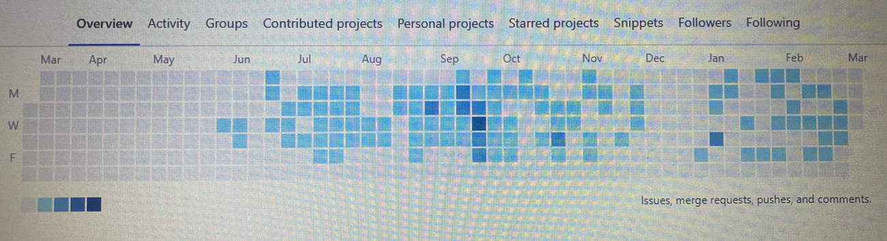
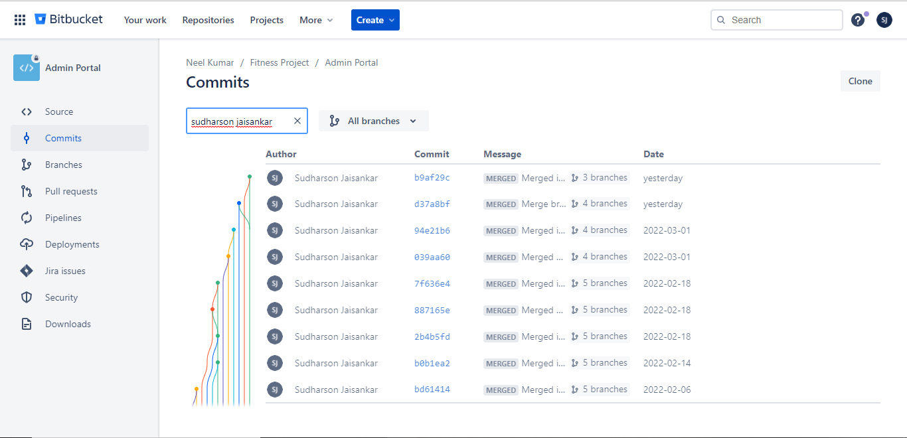

### Hi there 👋

I am professional web developer, who likes to design and code. Please look at some of my works.

<h2>Personal Projects</h2> 

<h3>How it all started</h3>

- https://sudhar611.github.io/cv/ - CV - static web page with pure HTML 
- https://sudhar611.github.io/css-mark1/ - Portfolio - static web page HTML & CSS
- https://sudhar611.github.io/mark3-tindog/ - Tinder for dogs ! - Built using Bootstrap
- https://sudhar611.github.io/mark4-dice/ - Roll dice - Built using HTML, CSS & JS
- https://sudhar611.github.io/mark5-drums/ - Play Drums on web page - Developed using HTML, CSS & JS
- https://sudhar611.github.io/mark5-simon/ - Simon Game ! - Test your memory power - Developed using HTML, CSS & JQuery
- https://infinite-ridge-61043.herokuapp.com/ - Just a fan of Iron man - Sigup page - Developed using HTML, CSS & jQuery - deployed in heroku 
- https://intense-plateau-97284.herokuapp.com/ - To do list ! - Developed using HTML, CSS, Express.js & Mongo DB - Deployed in heroku
- https://frozen-shore-52335.herokuapp.com/ - Publish Journal !  -  Developed using HTML, CSS, Express.js & Mongo DB - Deployed in heroku
- https://young-beyond-86878.herokuapp.com/ - Know your Secret ! - Developed using HTML, CSS, Express.js, OAuth & Mongo DB - Deployed in heroku

<h3>CSS challenges completed in Frontendmentor - https://www.frontendmentor.io/profile/Sudhar611</h3>

- https://sudhar611.github.io/nft-preview-card-component-main/
- https://sudhar611.github.io/base-apparel/
- https://sudhar611.github.io/four-card-feature-section/
- https://sudhar611.github.io/articlepreview/
- https://sudhar611.github.io/fylod/
- https://sudhar611.github.io/slider-master-coding-bootcamp/

<h3>React Projects</h3>

- http://buddy-trainer-ui.s3-website.ap-south-1.amazonaws.com/#/login - In Progress

<h3>Live Wordpress Websites Built and Maintained</h3>

Responsiblities - Post creation, SEO, Google analytics, Google webmaster, Google Adsense, Front end development, Logo design & Poster Creation

- https://gservants.com/ - News updates for central goverment employee's
- https://govtstaffnews.in/ - News updates for central goverment employee's
- https://fastagnews.in/ - Fastag news updates 

<b>Due to organization policies cannot disclose details of work related projects<b>

<h2>GitLab Contribution </h2>

<h2>Bit Bucket Contribution</h2>

  
<h3>🌱 I’m currently learning</h3>
  Java, spring & spring boot from Back end development course by IIT Roorkee in Great Learning
  
<!--
**Sudhar611/Sudhar611** is a ✨ _special_ ✨ repository because its `README.md` (this file) appears on your GitHub profile.

Here are some ideas to get you started:

- 🔭 I’m currently working on ...
- 🌱 I’m currently learning ...
- 👯 I’m looking to collaborate on ...
- 🤔 I’m looking for help with ...
- 💬 Ask me about ...
- 📫 How to reach me: ...
- 😄 Pronouns: ...
- ⚡ Fun fact: ...
-->
